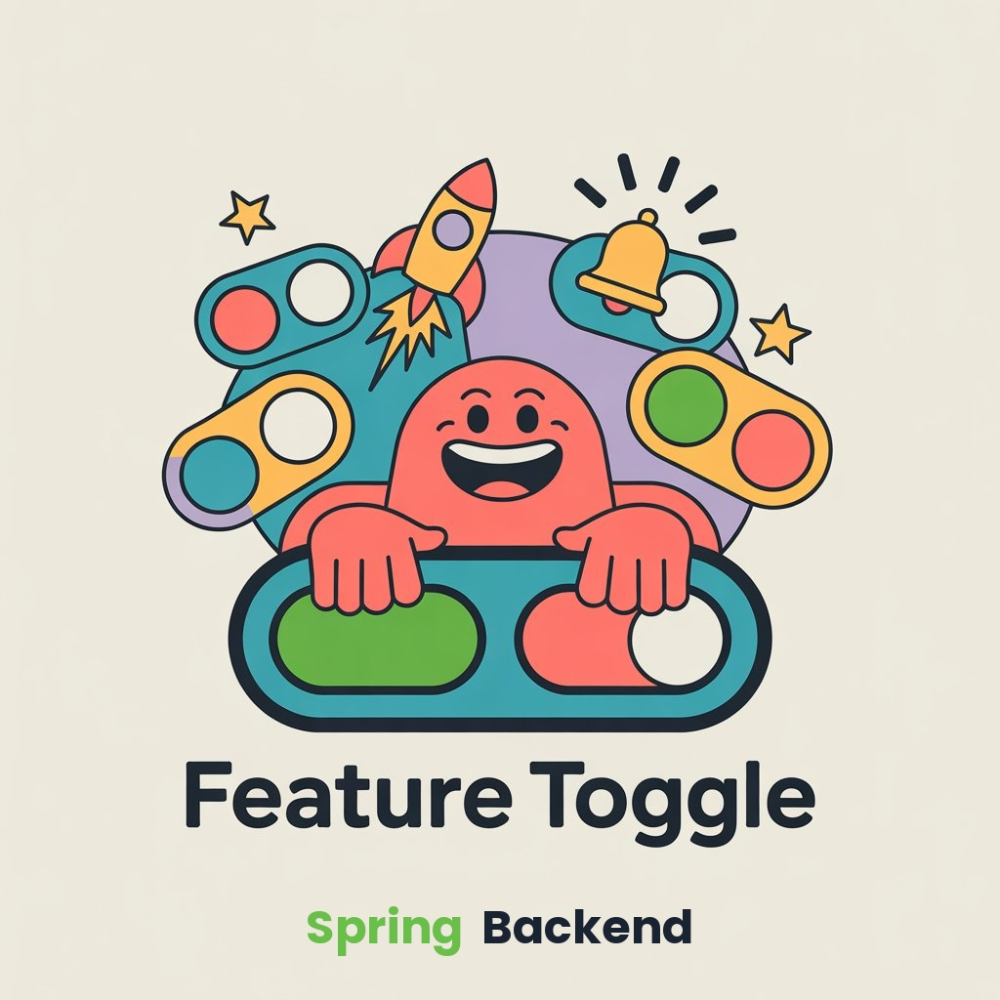

<div align="center">


# Homni Feature Toggle Backend

[](https://github.com/homni-labs/feature-toggle-backend-spring/actions/workflows/docker-publish.yml)
[](https://github.com/homni-labs/feature-toggle-backend-spring/releases)
[](https://github.com/homni-labs/feature-toggle-backend-spring/releases)

> Self-hosted платформа для управления feature-тоглами с RBAC на уровне проектов, мульти-средами и аутентификацией по API-ключам.
---
</div>

## Почему Homni?

Большинство решений для feature-тоглов либо только SaaS, либо не имеют нормального контроля доступа. Homni даёт:

- **Полный контроль** &mdash; разворачивайте на своей инфраструктуре, по своим правилам
- **Изоляция по проектам** &mdash; у каждого проекта свои тоглы, среды и участники
- **Гранулярный RBAC** &mdash; роли Admin / Editor / Reader на уровне проекта + платформенные администраторы
- **Среды** &mdash; включайте фичу на STAGING, не трогая PROD
- **Машинный доступ** &mdash; API-ключи с ограниченным сроком для SDK и CI/CD
- **Contract-first API** &mdash; спецификация OpenAPI 3.0 с генерацией клиентов и Swagger UI

---

## Быстрый старт

### Docker Compose

```bash
  docker compose up -d
```

Запускает PostgreSQL + Keycloak + приложение. Swagger UI доступен по адресу [localhost:8080/docs](http://localhost:8080/docs).

> В директории [`keycloak/`](keycloak/) находится пример конфигурации realm ([`feature-toggle-realm.json`](keycloak/feature-toggle-realm.json)) и кастомная тема логина ([`themes/`](keycloak/themes/)).

### Docker Hub

```bash
  docker pull zaytsevdv/homni-feature-toggle:latest   # или любой конкретный тег
```

### Из исходников

```bash
  mvn spring-boot:run
```

---

## Ключевые понятия

| Понятие | Описание |
|---------|----------|
| **Проект** | Изолированное рабочее пространство со своими тоглами, средами и участниками |
| **Тогл** | Фича-флаг, привязанный к одной или нескольким средам, может быть включён/выключен |
| **Среда** | Полностью настраиваемое окружение &mdash; создавайте, переименовывайте или удаляйте любые среды в рамках проекта (не ограничено DEV/STAGING/PROD) |
| **Участник** | Пользователь с ролью (Admin, Editor, Reader) внутри проекта |
| **API-ключ** | Токен только для чтения для SDK/машинного доступа, привязанный к проекту |

---

## Права доступа

| Действие | Platform Admin | Project Admin | Editor | Reader | API Key |
|----------|:-:|:-:|:-:|:-:|:-:|
| Создание / архивация проектов | + | | | | |
| Управление пользователями платформы | + | | | | |
| Управление участниками | + | + | | | |
| Управление API-ключами | + | + | | | |
| Управление средами | + | + | | | |
| Создание / обновление / удаление тоглов | + | + | + | | |
| Включение / выключение тоглов | + | + | + | | |
| Чтение тоглов | + | + | + | + | + |

> **Platform Admin** имеет неограниченный доступ ко всем проектам. Остальные роли действуют в рамках проекта. **API Key** предоставляет доступ только на чтение для SDK / машинной интеграции.

---

## API

Аутентификация: **Bearer JWT** (OIDC) или заголовок **`X-API-Key`**.

Полный контракт: [`api.yaml`](src/main/resources/openapi/api.yaml) &middot; Интерактивная документация доступна по `/docs` (Swagger UI) при запущенном приложении.

---

## Конфигурация

| Переменная | По умолчанию | Описание |
|------------|-------------|----------|
| `DB_HOST` | `localhost` | Хост PostgreSQL |
| `DB_PORT` | `5432` | Порт PostgreSQL |
| `DB_NAME` | `homni_feature_toggle` | Имя базы данных |
| `DB_USER` | `homni` | Пользователь БД |
| `DB_PASSWORD` | `homni` | Пароль БД |
| `OIDC_ISSUER_URI` | `http://localhost:8180/realms/feature-toggle` | URI издателя OIDC |
| `OIDC_ADMIN_EMAIL` | `admin@homni.local` | Email первого администратора (назначается при первом входе) |
| `CORS_ORIGINS` | `http://localhost:3000` | Разрешённые CORS-источники (`*` для разрешения всех) |

---

## Архитектура

Гексагональная архитектура (Ports & Adapters) со строгим DDD.

```
domain/           Чистая Java: агрегаты, value objects, доменные исключения
application/      Use-cases (один класс = одна операция) + интерфейсы портов
infrastructure/   Spring, JDBC-адаптеры, REST-контроллеры, безопасность
```

**`infrastructure` &rarr; `application` &rarr; `domain`** &mdash; домен ничего не знает о Spring, базах данных или HTTP.

| Решение | Обоснование |
|---------|-------------|
| Без Hibernate/JPA | Нативный SQL через `JdbcClient` &mdash; полный контроль, без магии |
| Без Lombok | Явные конструкторы, `public final` поля для value objects |
| Always Valid | Доменные объекты валидируют инварианты в конструкторах |
| Composition Root | Use-cases подключаются через `@Configuration`, а не `@Service` |

---

## Стек технологий

| | Технология |
|-|-----------|
| Runtime | Java 21, Spring Boot 3.4 |
| База данных | PostgreSQL 17, Liquibase |
| Безопасность | Spring Security, OAuth2 Resource Server (JWT) |
| Auth-провайдер | Keycloak (или любой OIDC-провайдер) |
| API | OpenAPI 3.0, кодогенерация контроллеров |
| CI/CD | GitHub Actions &rarr; Docker Hub |

---

## Планы

- [ ] Web UI &mdash; полноценный фронтенд для управления тоглами
- [ ] Java SDK &mdash; нативная клиентская библиотека без зависимостей
- [ ] Бэкенд на Quarkus &mdash; альтернативный легковесный runtime
- [ ] Аудит действий &mdash; логирование всех действий пользователей и SDK
- [ ] Графы зависимостей тоглов &mdash; визуализация связей между тоглами
- [ ] Вебхуки &mdash; уведомление внешних систем об изменении состояния тоглов
- [ ] Тоглы по расписанию &mdash; автоматическое включение/выключение в заданное время
- [ ] Обнаружение устаревших тоглов &mdash; поиск тоглов без изменений за N дней
- [ ] Дашборд метрик &mdash; статистика использования тоглов, SDK, латенси
- [ ] Python & Go SDK &mdash; мультиязычная поддержка клиентов

---

## Участие в разработке

Мы рады любому вкладу! Будь то баг-репорт, предложение фичи или pull request &mdash; всё ценно.

1. Форкните репозиторий
2. Создайте ветку (`git checkout -b feature/amazing-feature`)
3. Закоммитьте изменения
4. Запушьте и откройте Pull Request

Для крупных изменений сначала откройте [issue](https://github.com/homni-labs/feature-toggle-backend-spring/issues), чтобы обсудить что вы хотите улучшить.

---

## Безопасность

Если вы обнаружили уязвимость, пожалуйста, **не** создавайте публичный issue. Вместо этого свяжитесь напрямую через [Telegram](https://t.me/zaytsev_dv) или по email zaytsev.dmitry9228@gmail.com.

---

## Контакты

| Канал | Ссылка |
|-------|--------|
| GitHub Discussions | [discussions](https://github.com/homni-labs/feature-toggle-backend-spring/discussions) |
| Telegram | [@zaytsev_dv](https://t.me/zaytsev_dv) |
| Email | zaytsev.dmitry9228@gmail.com |

## Лицензия

Проект лицензирован под [MIT License](LICENSE).

---

<p align="center">Сделано с заботой в <a href="https://github.com/homni-labs">Homni Labs</a></p>
